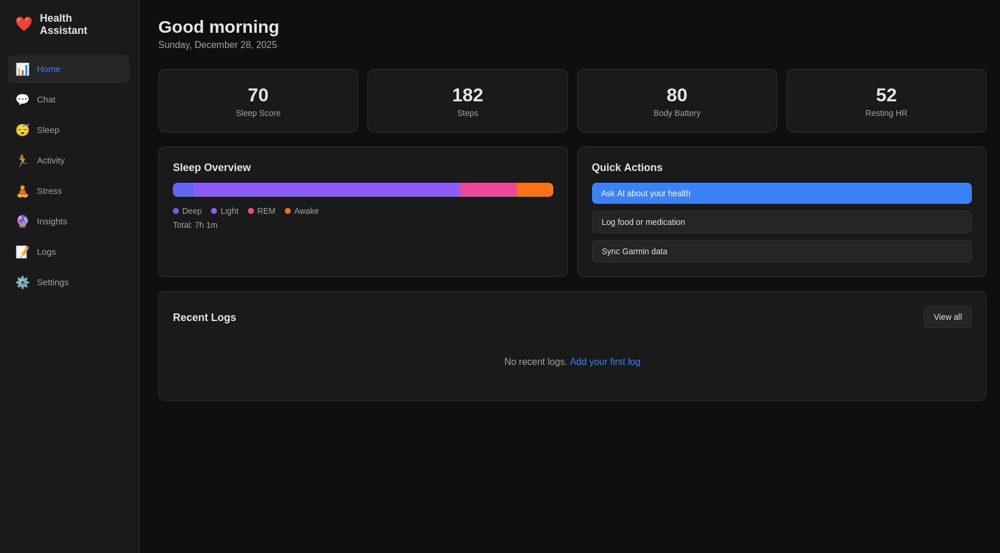
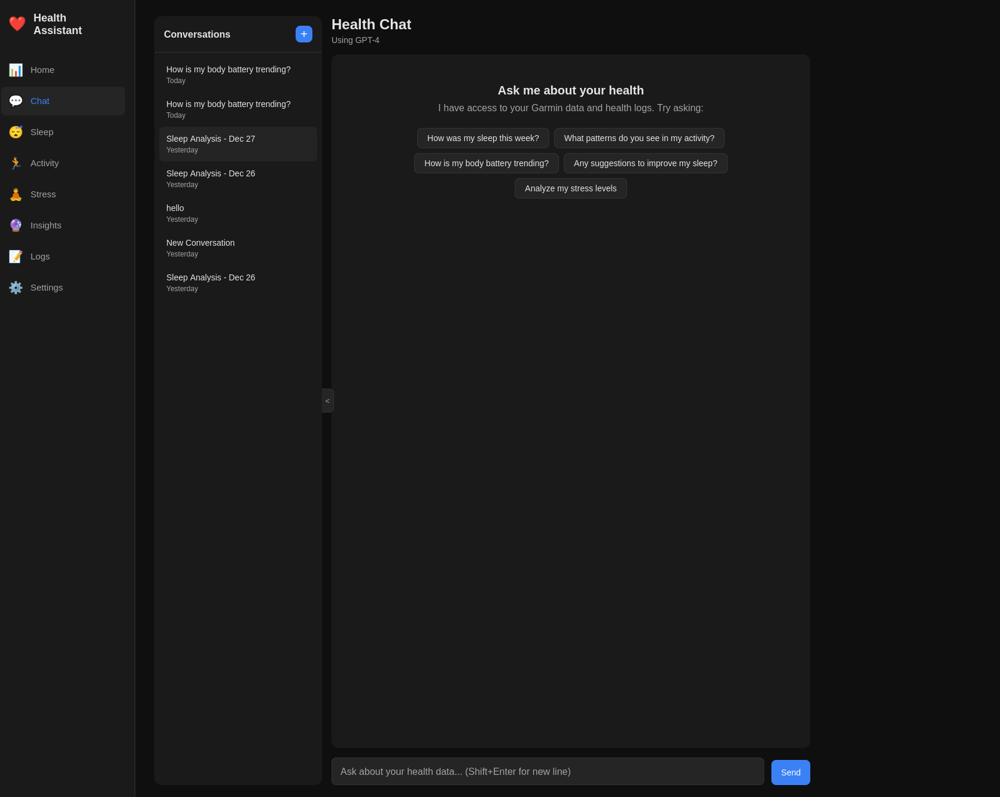
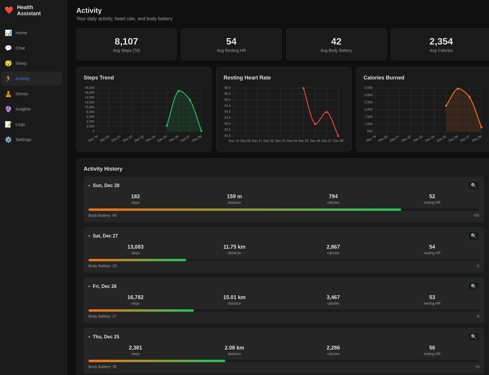
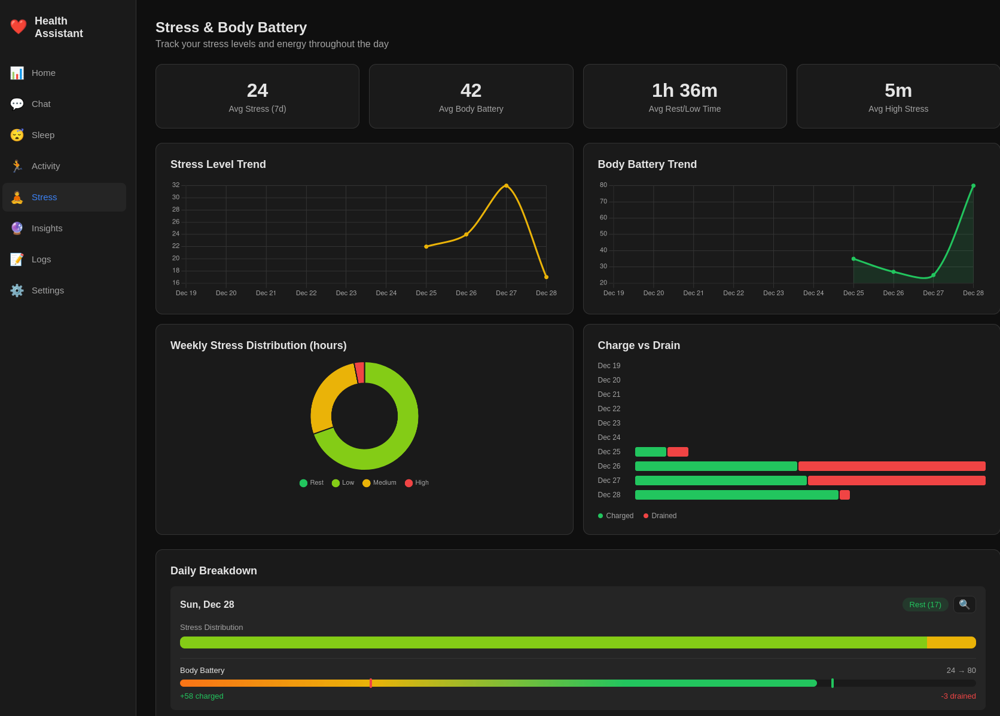

# Health Assistant

A personal health assistant that connects to your Garmin Connect account and uses AI to analyze your health data. Get insights about your sleep, activity, stress levels, and more through natural conversation.

## Important note

This is 100% vibecoded, use at your own discretion.

## Screenshots


*Dashboard with daily health metrics and sleep overview*


*AI chat with conversation history*


*Activity page with trend charts for steps, heart rate, and calories*


*Stress & Body Battery with trend lines, weekly distribution, and charge vs drain*

## Features

- **End-to-End Encryption** - Your health data is encrypted with a key only you control
- **BIP39 Recovery Phrase** - 24-word mnemonic for secure key recovery
- **Multi-User Support** - Per-user encrypted data storage with Supabase auth
- **Garmin Connect Integration** - Sync sleep, activity, stress, and body battery data
- **AI-Powered Analysis** - Chat with AI about your health patterns (keys stored locally)
- **Multiple AI Providers** - Choose between Claude (Anthropic), GPT-4 (OpenAI), or Ollama (local)
- **Conversation History** - Organized chat conversations with full history
- **Manual Logging** - Track food intake, medications, and health notes
- **Privacy-Focused** - Zero-knowledge architecture, data encrypted client-side

## Pages

- **Dashboard** - Overview of your recent health metrics
- **Sleep Analysis** - Sleep duration, stages, quality scores, and heart rate during sleep
- **Activity** - Steps, calories, heart rate, and expandable individual workouts
- **Stress & Body Battery** - Stress distribution and energy levels throughout the day
- **Chat** - AI-powered health conversations with conversation history
- **Logs** - Manual food, medication, and health notes

## Requirements

- Node.js 18+
- Python 3.8+ (for Garmin Connect integration)
- A Garmin Connect account
- API key for Claude, OpenAI, or a local Ollama instance

## Installation

1. **Clone the repository**
   ```bash
   git clone https://github.com/yourusername/health-assistant.git
   cd health-assistant
   ```

2. **Install Node.js dependencies**
   ```bash
   npm install
   ```

3. **Set up Python environment**
   ```bash
   python -m venv .venv
   source .venv/bin/activate  # On Windows: .venv\Scripts\activate
   pip install garminconnect
   ```

4. **Create environment file**
   ```bash
   cp .env.example .env
   ```

5. **Initialize the database**
   ```bash
   npm run db:push
   ```

6. **Start the development server**
   ```bash
   npm run dev
   ```

7. **Open the app** at `http://localhost:5173`

## Local Mode vs Hosted Mode

### Local Mode (Default)
Set `LOCAL_MODE=true` in `.env` for completely offline usage:
- No Supabase account needed
- No internet required after initial setup
- AI keys stored in browser localStorage
- All data stored in local SQLite
- Single user (no auth)

### Hosted Mode
Set `LOCAL_MODE=false` and configure Supabase for multi-user deployment:
- Magic link email authentication
- End-to-end encrypted data storage
- Per-user encryption keys (BIP39 mnemonic)
- Optional Turso cloud database

## Configuration

### Garmin Connect

1. Go to **Settings** in the app
2. Enter your Garmin Connect email and password
3. Click **Connect Garmin**
4. Use **Sync Now** to fetch your health data

Your credentials are only used to obtain OAuth tokens and are not stored. Tokens are saved locally in `~/.garminconnect`.

### AI Provider

Choose one of three AI providers in Settings:

#### Claude (Anthropic)
- Get an API key from [console.anthropic.com](https://console.anthropic.com)
- Paste your API key in Settings

#### GPT-4 (OpenAI)
- Get an API key from [platform.openai.com](https://platform.openai.com)
- Paste your API key in Settings

#### Ollama (Local)
- Install Ollama from [ollama.ai](https://ollama.ai)
- Run a model: `ollama run llama2`
- Enter your Ollama endpoint (e.g., `http://localhost:11434`)
- Enter the model name (e.g., `llama2`, `mistral`, `codellama`)

## Usage

### Syncing Data

1. Go to **Settings**
2. Select how many days to sync (1-30 days)
3. Click **Sync Now**

Data is stored locally in SQLite and includes:
- Sleep stages, duration, and quality
- Daily steps, calories, and heart rate
- Stress levels and body battery
- Individual workout activities

### Chatting with AI

1. Go to **Chat**
2. Ask questions about your health data:
   - "How was my sleep this week?"
   - "What patterns do you see in my activity?"
   - "Analyze my stress levels"

The AI has access to your last 7 days of health data and provides personalized insights.

**Chat shortcuts:**
- `Enter` - Send message
- `Shift+Enter` - New line

### Analyzing Specific Days

Each page (Sleep, Activity, Stress) has an **Analyze** button (🔍) next to each day. Click it to start a new conversation focused on that specific day's data.

On the Activity page, you can expand each day to see individual workouts and analyze them separately.

### Manual Logging

Use the **Logs** page to track:
- **Food** - Meals with optional calories and macros
- **Medications** - Name, dosage, and timing
- **Notes** - General health observations with tags

## Project Structure

```
health-assistant/
├── src/
│   ├── lib/server/       # Server-side code
│   │   ├── db/           # Database schema and client
│   │   ├── ai/           # AI provider integration
│   │   └── garmin/       # Garmin API wrapper
│   ├── routes/           # SvelteKit pages and API routes
│   └── app.css           # Global styles
├── python/
│   └── garmin_service.py # Garmin data fetcher
└── data/                 # SQLite database (created automatically)
```

## Tech Stack

- **Frontend/Backend**: SvelteKit 2 with Svelte 5
- **Authentication**: Supabase Auth (magic link email)
- **Database**: SQLite/Turso with Drizzle ORM (libSQL)
- **Encryption**: AES-256-GCM, BIP39 mnemonic, PBKDF2 key derivation
- **Key Storage**: IndexedDB (client-side)
- **AI**: Anthropic Claude, OpenAI GPT-4, or Ollama (client-side calls)
- **Garmin**: Python `garminconnect` library via subprocess

## Privacy & Security

This app uses a zero-knowledge encryption architecture:

- **End-to-End Encryption** - All health data is encrypted client-side with AES-256-GCM
- **BIP39 Mnemonic** - Your encryption key is derived from a 24-word recovery phrase
- **Key Never Leaves Browser** - The server never sees your decryption key
- **AI Keys Encrypted Locally** - API keys stored in IndexedDB, encrypted with your key
- **Per-User Data Isolation** - Each user's data is encrypted with their unique key
- **No Analytics or Tracking** - Your data is yours alone

### How Encryption Works

1. On first login, you generate (or enter) a 24-word BIP39 recovery phrase
2. This phrase derives a unique encryption key using PBKDF2 (600,000 iterations)
3. All your health data is encrypted before leaving the browser
4. The server only stores encrypted blobs - it cannot read your data
5. Your recovery phrase is the ONLY way to access your data

**Important:** Write down your recovery phrase and keep it safe. If you lose it, your data cannot be recovered.

## Deployment

### Requirements for Production

- **Node.js server** (for API routes and Python subprocess)
- **Supabase project** (for authentication)
- **Turso database** (optional, for cloud SQLite)
- **Python environment** (for Garmin data fetching)

### Environment Variables

```bash
# Supabase (required)
PUBLIC_SUPABASE_URL=https://your-project.supabase.co
PUBLIC_SUPABASE_ANON_KEY=your-anon-key

# Turso (optional, for cloud database)
TURSO_DATABASE_URL=libsql://your-db.turso.io
TURSO_AUTH_TOKEN=your-turso-token
```

### Deployment Options

#### Railway / Fly.io / VPS
Best for full functionality including Garmin integration:

1. Deploy the Node.js app
2. Include Python in your Dockerfile/buildpack
3. Set environment variables
4. Run `npm run db:push` to initialize database

#### Note about Serverless
Vercel/Netlify serverless functions cannot run the Python Garmin script. For serverless deployment, Garmin sync functionality would need to be refactored.

## Development

```bash
# Run development server
npm run dev

# Build for production
npm run build

# Preview production build
npm run preview

# Push database schema changes
npm run db:push
```

## License

MIT
